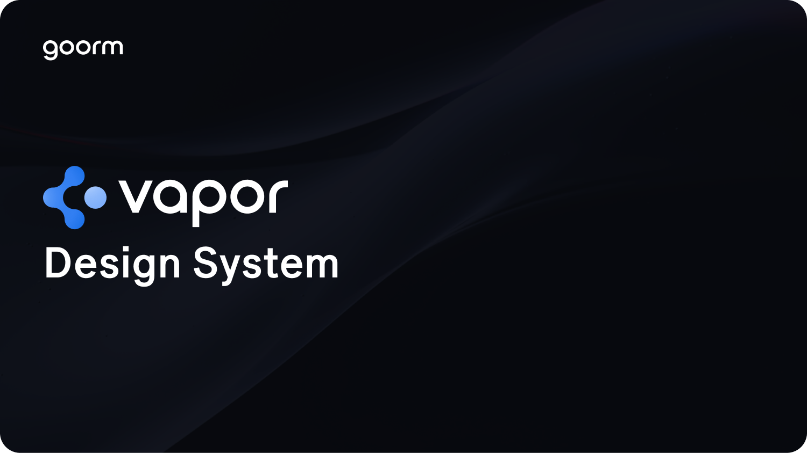

[](https://radix-ui.com/primitives)

# Goorm Design System: Vapor UI

[](https://github.com/goorm-dev/vapor-ui) [](https://opensource.org/licenses/MIT)

> 🚧 **This project is currently in a pre-release state.** 🚧
> 
> It is under active development, and breaking changes may be introduced at any time.
> We do not recommend using this in a production environment. The first stable release is planned for `v0.2.0`.

<br/>

**An open-source UI component library for building high-quality, accessible web apps and design systems.**

Vapor is a React-based UI library designed with a focus on accessibility, customization, and developer experience. Use it as a foundation layer for your design system or gradually adopt it into existing projects.

---

## Documentation

- **[Usage](https://vapor.goorm.io/guides/installation)**: Learn how to install and configure the library.
- **[Contributing](https://vapor.goorm.io/guides/contributing)**: Guidelines for contributing to the project and local setup instructions.
- **[Releases](https://vapor.goorm.io/guides/changelog)**: View changes for each version.

## Getting Started

To install Vapor UI in your project, use the following command:

```bash
npm i @vapor-ui/core @vapor-ui/icons @vapor-ui/hooks
```

For detailed usage instructions, please refer to the [official documentation](https://vapor.goorm.io/guides/installation).

## Core Principles

- **Consistency**: Provides a unified user experience across any application.
- **Reusability**: Well-defined components and logic reduce repetitive work and increase productivity.
- **Flexibility**: The theme system allows for easy customization.
- **Reliability**: All code is written in TypeScript for predictable and stable development.

## Package Structure

Vapor is a monorepo that efficiently manages multiple packages using pnpm Workspace and Turborepo.

| Package                 | Description                                                          | NPM                                                                                                       |
| ----------------------- | -------------------------------------------------------------------- | --------------------------------------------------------------------------------------------------------- |
| @vapor-ui/core          | Core UI component library                                            | [](https://www.npmjs.com/package/@vapor-ui/core)   |
| @vapor-ui/icons         | A set of SVG icon React components used in the VaporUI design system | [](https://www.npmjs.com/package/@vapor-ui/icons) |
| @vapor-ui/hooks         | A collection of reusable React hooks for the VaporUI design system   | [](https://www.npmjs.com/package/@vapor-ui/hooks) |
| apps/website            | Official documentation website                                       | -                                                                                                         |
| @repo/eslint-config     | Shared ESLint configuration                                          | -                                                                                                         |
| @repo/typescript-config | Shared TypeScript tsconfig configuration                             | -                                                                                                         |

## Community & Support

- **Bugs & Feature Requests**: Use [GitHub Issues](https://github.com/goorm-dev/vapor-ui/issues) to report bugs or request new features.
- **Discord**: Join the [Vapor UI Discord](https://discord.gg/PMqxs3xaHC) to chat with the community and team.
- **Email**: For other inquiries, you can contact us at vapor.ui@goorm.io
