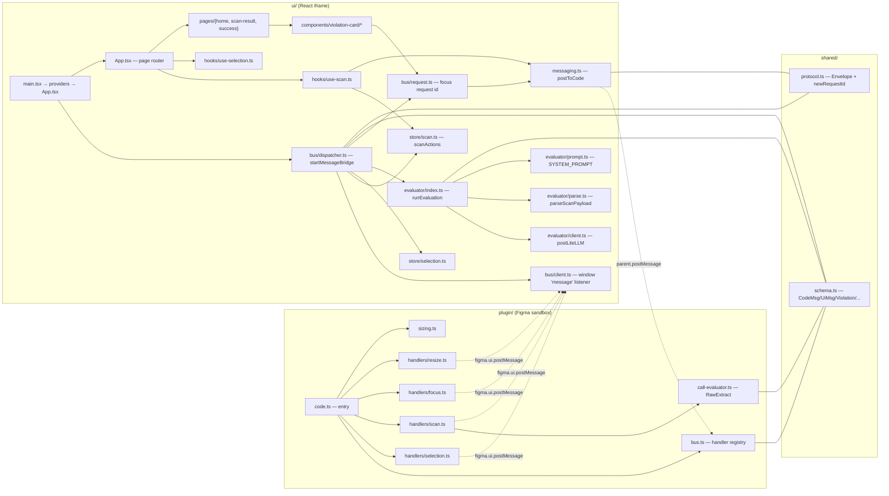
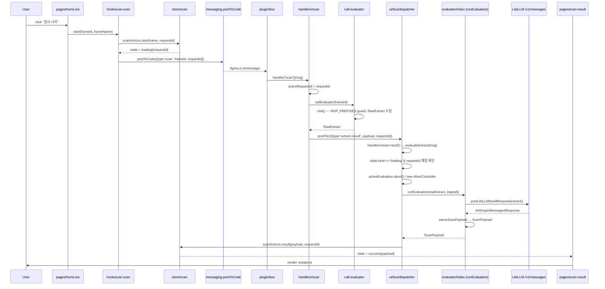
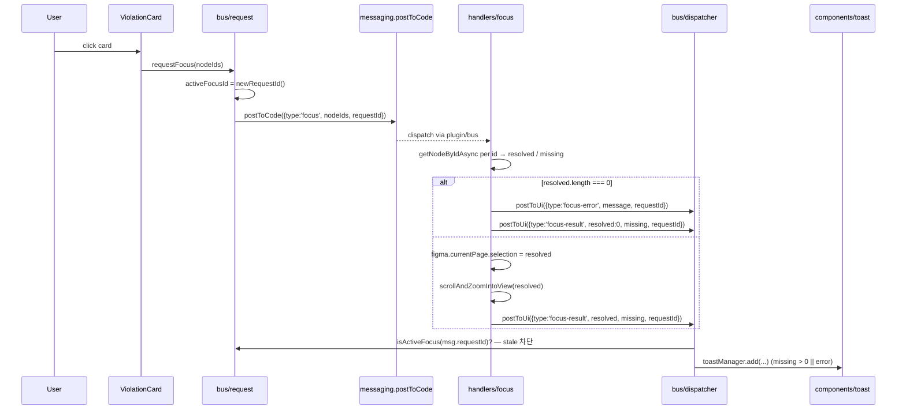
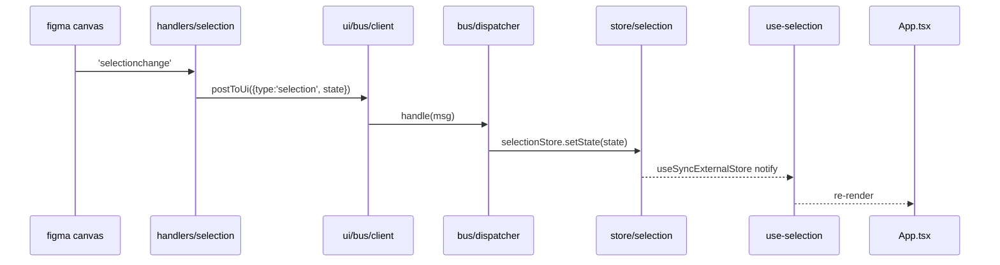
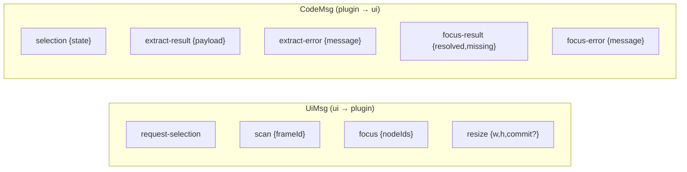
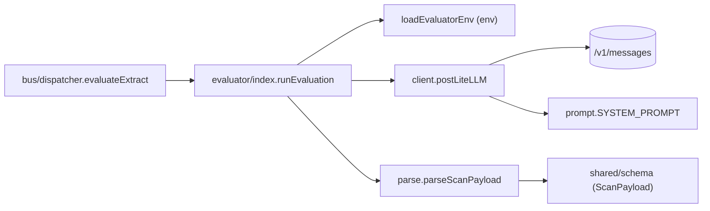

# figma-token-review-plugin — 실행 흐름 (현 상태)

날짜: 2026-06-29
대상: `apps/figma-token-review-plugin/src`
목적: ui/ ↔ plugin/ 의존 관계와 런타임 흐름 한눈 파악. 후속 구조 다듬기의 입력.

## 1. 두 세계 — 샌드박스와 iframe

Figma 플러그인은 두 분리된 컨텍스트가 메시지로만 대화한다.

- `plugin/` (Figma 샌드박스) — DOM 없음, `figma.*` API 접근 가능
- `ui/` (iframe React 앱) — DOM 있음, `figma.*` 직접 호출 불가, HTTP fetch 가능

핵심 비대칭:
- **plugin 쪽**: `bus.ts`가 `Map<UiMsg['type'], Handler>`로 핸들러 라우팅. 각 핸들러는 `on('type', fn)` 등록.
- **ui 쪽**: `bus/client.ts`는 fan-out 리스너 셋 (`Set<Listener>`), 라우팅은 `bus/dispatcher.ts`의 `switch(msg.type)`.

## 2. 부팅 시퀀스

```mermaid
sequenceDiagram
    participant F as Figma host
    participant C as plugin/code.ts
    participant Hs as handlers (selection/scan/focus/resize)
    participant B as plugin/bus
    participant U as ui/main.tsx
    participant Pr as ui/providers
    participant Br as bus/dispatcher
    participant Cl as bus/client

    F->>C: load code.js
    C->>F: figma.showUI(__html__, DEFAULT_SIZE)
    C->>C: restoreSavedSize()
    C->>Hs: initSelection / initScan / initFocus / initResize
    Hs->>B: on('request-selection'|'scan'|'focus'|'resize', handler)
    C->>B: start() — figma.ui.onmessage = dispatcher
    F->>U: load index.html (iframe)
    U->>Pr: <Providers><App/>
    Pr->>Br: startMessageBridge()
    Br->>Cl: onMessage(handle)
    Cl->>Cl: window.addEventListener('message', ...)
    Pr->>B: postToCode({type:'request-selection'})
    B->>Hs: dispatch → handlers/selection.emit()
    Hs->>Cl: postToUi({type:'selection', state})
    Cl->>Br: handle(msg) → selectionStore.setState
```

handlers/selection 는 `figma.on('selectionchange', emit)`도 등록해 사용자가 캔버스에서 선택을 바꾸면 자동 emit.

## 3. 스캔 흐름 (사용자 핵심 경로)

게이트:
- `handlers/scan.ts`의 `activeRequestId` race 가드 — 사용자가 빠르게 두 번 스캔하면 옛 결과 버림
- `dispatcher.evaluateExtract`의 `activeEvaluation` AbortController + `state.requestId` 재확인 — 옛 LLM 응답 무시
- `scanActions.result`의 `state.requestId !== requestId` 가드 — store 단에서 한 번 더

요청 ID가 **세 곳에서 라이프사이클을 가짐** (plugin handler, ui dispatcher, ui store). 같은 ID로 일관성 유지 책임이 분산.

## 4. Focus 흐름

여기도 ID 매칭. focus는 store가 없고 `bus/request.ts`의 모듈 전역 `activeFocusId`로만 stale 차단.

## 5. Selection 흐름 (수동성 dispatch)

## 6. 메시지 타입 (shared/schema.ts)

모든 envelope에 optional `requestId`가 붙어 race 가드의 동맥 역할.

## 7. 평가자 (LLM) 계층

**중요 비대칭**: 평가자는 ui/ 안에 있지만 본질은 plugin이 만든 `RawExtract`를 외부 LLM에 보내 의미 판정을 받는 **두 번째 추출-검증 단계**. plugin 쪽 `call-evaluator.ts`가 1단(결정론) extract, ui 쪽 `evaluator/`가 2단(LLM) evaluate. 이름이 헷갈리는 지점 — `plugin/call-evaluator.ts`는 **추출기**, `ui/evaluator/`는 **평가자**.

## 8. 의존성 한눈에

| 책임 | 위치 | depends on |
|---|---|---|
| Figma API 호출 | plugin/handlers, call-evaluator | figma.* (global) |
| 메시지 라우팅 (plugin) | plugin/bus.ts | shared/protocol |
| 메시지 라우팅 (ui) | ui/bus/dispatcher.ts | store/*, evaluator, components/toast, bus/request |
| 메시지 송수신 (ui) | ui/bus/client.ts, messaging.ts | window/parent (global) |
| 요청 ID 발급 | shared/protocol.newRequestId | Date.now, Math.random |
| 요청 ID 추적 | handlers/scan 모듈 전역, store/scan.state, bus/request 모듈 전역 | (분산) |
| LLM 호출 | ui/evaluator/* | fetch, env |
| 토스트 | components/toast (toastManager) | dispatcher가 직접 호출 |
| 페이지 라우팅 | App.tsx switch(state.kind) | store/scan |

## 9. 현재 구조의 결합 지점 — 다듬기 후보 (사실 관찰만)

- `bus/dispatcher.ts`가 **라우터 + 평가 오케스트레이션 + 토스트 트리거**를 동시에 책임. `handle()`은 라우터로 깔끔하지만 `evaluateExtract`가 같은 파일에 있고 store/evaluator/toast/request 4개에 모두 의존.
- 요청 ID 라이프사이클이 **3곳에 분산** (handlers/scan 모듈 전역, store/scan.state.requestId, bus/dispatcher activeEvaluation). 누가 정본인지 모호.
- `plugin/call-evaluator.ts` 이름이 ui의 `evaluator/`와 충돌 (둘 다 "평가자"라 부르기). 한쪽은 추출, 한쪽은 LLM 판정.
- `bus/request.ts`의 모듈 전역 `activeFocusId`만 focus race 가드. focus 결과 처리도 dispatcher 안 switch case로 흩뿌려짐.
- ui 메시지 입구가 둘: `bus/client.ts` (저수준 window listener fan-out) + `bus/dispatcher.ts` (switch-router). plugin 쪽은 한 곳에서 Map 라우팅.

이 관찰은 다이어그램 자체가 아니라 다음 단계 brainstorming 입력.
