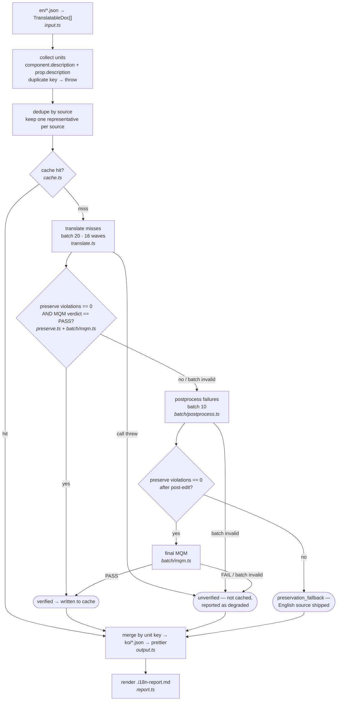

# CLAUDE.md

This file provides guidance to Claude Code (claude.ai/code) when working with code in this repository.

## Commands

```bash
# Type check
pnpm --filter @vapor-ui/translation-pipeline typecheck

# Lint
pnpm --filter @vapor-ui/translation-pipeline lint

# Run all tests
pnpm --filter @vapor-ui/translation-pipeline test:run

# Run a single test file
pnpm --filter @vapor-ui/translation-pipeline test:run -- src/translator.test.ts

# Run tests with coverage
pnpm --filter @vapor-ui/translation-pipeline test:coverage

# Build
pnpm --filter @vapor-ui/translation-pipeline build
```

Path alias `~` maps to `src/`. (`~/domain` → `src/domain.ts`)

## Architecture

### Core Flow

```
cli.ts                          # entry point: .env loading + error handler
  → run.ts                      # orchestrator: CLI parsing · env check · stage order
      → input.ts                # ① read en/*.json → TranslatableDoc[]
      → translator.ts           # dedupe → cache → phase 1 translate → phase 2 evaluate
          → translate.ts        # ② LLM initial translation (cross-component batch of 20)
          → batch/lifecycle.ts  # ③ preservation check + MQM → postprocess → recheck
              → batch/mqm.ts        # batch MQM prompt · schema · call
              → batch/postprocess.ts # batch post-edit prompt · schema · call
              → preserve.ts         # deterministic string-preservation checks
      → output.ts               # ④ merge into raw JSON · write ko/*.json · prettier
      → report.ts               # ⑤ renders .i18n-report.md

batch-call.ts                   # shared LLM batch protocol: schema call + JSON parse + id reconcile
client.ts                       # LLM transport: retries + 60s timeout
```

The tree above says which file owns what. The graph below says what actually happens to one
unit — in particular where it can leave the pipeline with its English source intact.



Three things the graph is there to make un-missable: the quality gate is **one** AND of a
deterministic check and an LLM verdict, not two sequential gates; a preservation violation that
survives post-editing exits before the final MQM with the English source; and only the `verified`
path writes to the cache.

### Module Boundaries

- **`run.ts`**: Call order only — CLI flags, env check, then each stage in turn. No logic of its own.
- **`input.ts` · `output.ts`**: Own all file I/O. `input.ts` normalizes en JSON to `TranslatableDoc[]`, resolving each doc's identity as `displayName ?? name`; `output.ts` looks each translation up **by unit key** and merges it into the raw JSON, then writes `ko/*.json`. Neither depends on document or prop order. No LLM logic.
- **`translator.ts`**: Deduplicates by source string, decides cache hit/miss, forms cross-component batches, runs the two phases in concurrency-capped waves, and returns a key → Korean dictionary. Does not touch JSON or call the LLM directly. Its `outcomes` map is keyed by **source**, not by unit key — a judgment depends only on the source string, so there is deliberately no fan-out step that copies one result across a duplicate group. Per-unit lookup is `outcomes.get(unit.source)`.
- **`batch/lifecycle.ts`**: Runs one MQM batch: deterministic preservation check + batch MQM → batch postprocess → preservation recheck → final MQM. Only called from `translator.ts`. The recheck is not its own module — it is a second call into `batch/mqm.ts` and `preserve.ts`.
- **`batch/mqm.ts` · `batch/postprocess.ts`**: One LLM step each — prompt, JSON schema, and the `callBatch` invocation. `batch/_types.ts` holds the types that only circulate inside `batch/`.
- **`batch-call.ts`**: The shared shell for every batch LLM call — schema call → content check → JSON parse → id reconcile. Lives at the root because both stage ② (`translate.ts`) and stage ③ (`batch/`) use it.
- **`preserve.ts`**: Deterministic checks only — no LLM. Owns code spans, bare identifiers, URLs, markdown structure.
- **`client.ts`**: Single wrapper for LiteLLM `/chat/completions`. Every LLM call goes through this file.
- **`domain.ts`**: Types that flow between stages. `MqmCategory` union is the single source of truth. Adding or removing a category here causes a compile error in `batch/mqm.ts` via the `satisfies` check on `MQM_CATEGORY_VALUES`. Also owns `TranslationUnit` (a two-variant union — `component.description` carries no `propName`, so the write-back branch is exhaustive-checked), `makeUnitKey`/`getTranslationUnitKey`, `getUnitOwnerName`, and `makeOutcome` — `assurance`/`reportable` are derived from `reason` in `REASON_META`, nowhere else. `TranslationOutcome` carries no unit key: the map that holds it says which source it belongs to, and the report label (`ReportedOutcome.key`) is attached in `report.ts`, the only place that needs it.
- **`util.ts`**: `chunkArray` and `errorMessage` only — anything with a single consumer belongs next to that consumer.

### Design Constraints — Read Before Modifying

**MQM mirroring rule**: The Style rules in `translate.ts` and the `Fluency/Unnatural phrasing` criteria in `batch/mqm.ts` intentionally contain the same content. Changing one requires changing the other. If they diverge, the initial MQM will fail more often, increasing postprocess cost.

**Units are identified by name, never by position**: every request/response id and every dictionary key is `getTranslationUnitKey(unit)` — `${componentDisplayName}:${propName}`, or `${componentDisplayName}:(description)` for a component's own description. The `(description)` sentinel cannot collide with a prop name because parentheses are not valid in identifiers.

Use `displayName`, not `name`: 194 of the 200 extracted docs differ between the two, and `name` is `Root` in 25 of them. Keying on `name` makes `reconcileById` silently map results onto the wrong component. `collectTranslationUnits` throws on a duplicate key rather than overwriting.

**No positional coupling**: `translateDescriptions` returns `translations: Map<key, string>`, not a rebuilt `TranslatableDoc[]`. There is deliberately no function that reassembles the input tree — adding one reintroduces the index fields this contract removed.

**Dedupe before concurrency**: 74.3% of units share a source string (inherited base-ui props). `translator.ts` translates unique sources only. The cache alone cannot do this job once batches run concurrently — 16 in-flight batches don't see each other's writes.

**Batch sizes are derived, not tuned by feel**: `(timeout − margin) × throughput ÷ output tokens per unit ÷ safety factor 2`. At the measured 81 tok/s that yields translate 20, MQM 74. Changing the 60s timeout in `client.ts` moves both.

**Deterministic checks own preservation**: code spans, identifiers, URLs, and markdown structure are checked in `preserve.ts`, not by the LLM (KAN-12: LLM judgment at string level is unreliable). A unit that still violates after post-editing keeps its **English source** (`preservation_fallback`) rather than shipping broken Korean.

**Cache key composition**: `makeCacheKey` in `cache.ts` hashes `version + source + targetLocale + translationModel + validationModel + postprocessModel`. Changing any model name in `defaults.ts` invalidates the entire cache and triggers a full re-translation on the next run.

**Degraded outcome**: If any batch step (MQM, postprocess, or final MQM) returns a malformed response, the affected units are marked `unverified` (`batch_mqm_failed`, `batch_postprocess_failed`, `batch_final_mqm_failed`). A translation call that throws degrades only its own batch to English (`translation_failed`) instead of killing the run.

**Batch fallbacks carry no component name**: batches mix components, so the first unit's component is not the cause of a batch failure. `batchFallbacks` is a `string[]` of reasons and the report renders reasons only — do not reintroduce a Component column that would name an innocent component.

**Cache write timing**: Only `verified` outcomes are written to cache, and the cache is saved once after the MQM phase — the phases are split, so there is no per-component checkpoint to save at.

### Test Structure

All LLM calls are replaced with `vi.mock('~/client')`. No test hits a real API. `tests/cli.test.ts` creates a tmp directory and validates the full file I/O pipeline end-to-end. Env vars are injected with `vi.stubEnv` — there is no DI hole in the production interface for tests to reach through.

Coverage excludes the I/O shell (`src/cli.ts`, `src/run.ts`, `src/input.ts`, `src/output.ts`). Thresholds: 70% lines/functions/statements, 65% branches.
